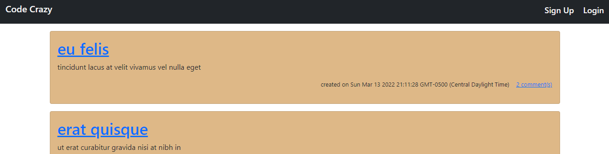

# code-crazy

## Website

https://code-crazy.herokuapp.com/

## Description

Code Crazy was designed for coding nerds around the world! In here, coders can add posts about their favorite... or least favorite aspects of coding. Create an account, log in, and start posting and commenting to your heart's content!



## Instructions for Local Use

1. download the project files from the [GitHub Repository](https://github.com/mimi5930/code-crazy)

2. open the root directory and install this project's dependencies

```
npm i
```

3. Log into MySQL and initialize the database

```
mysql -u **** -p
```

```
SOURCE db/schema.sql
```

4. Run the application

```
npm start
```

## Tests

This package comes with randomly created seeds for the database. Just run the command:

```
npm run seed
```

## Questions

Please [email](mikej.miller440@gmail.com) me with any questions!
